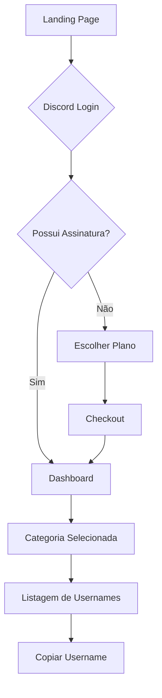

## 1. Product Overview
Plataforma de venda de acesso a usernames raros (OG Usernames) em diversas plataformas. Usuários compram assinaturas para visualizar listas de nomes disponíveis em tempo real.

**Problema:** Dificuldade em encontrar usernames raros disponíveis antes que outros usuários os registrem.
**Solução:** Bot monitora disponibilidade 24/7 e plataforma vende acesso a essas informações através de assinaturas.

## 2. Core Features

### 2.1 User Roles
| Role | Registration Method | Core Permissions |
|------|---------------------|------------------|
| Usuário | Discord OAuth2 | Visualizar landing page, comprar assinaturas |
| Assinante Ativo | Assinatura paga | Acessar dashboard, visualizar usernames raros |
| Admin | Manual | Gerenciar usuários, visualizar métricas |

### 2.2 Feature Module
Nossa plataforma consiste nas seguintes páginas principais:

1. **Landing Page**: Hero section, recursos, preços, FAQ
2. **Dashboard**: Grid de categorias, sidebar de navegação
3. **Listagem de Usernames**: Tabela com filtros por plataforma
4. **Checkout/Assinatura**: Escolha de planos e pagamento

### 2.3 Page Details
| Page Name | Module Name | Feature description |
|-----------|-------------|---------------------|
| Landing Page | Hero Section | Título impactante "Encontre usernames raros antes de todo mundo", botão CTA "Entrar com Discord" |
| Landing Page | Features Section | Explicar monitoramento 24/7 do bot, atualizações em tempo real |
| Landing Page | Pricing Cards | Cards visuais com planos Diário, Semanal, Mensal com preços |
| Landing Page | FAQ Accordion | Perguntas frequentes sobre funcionamento e garantias |
| Dashboard | Sidebar Navigation | Avatar do usuário, categorias, status da assinatura, logout |
| Dashboard | Category Grid | 6 cards visuais (2x3 grid) para categorias de usernames |
| Listagem | Username Table | Tabela com username, plataforma, status, data, botão copiar |
| Listagem | Platform Filter | Filtro dropdown para selecionar plataformas específicas |
| Listagem | Copy Feedback | Feedback visual (checkmark) ao copiar username |
| Assinatura | Plan Selection | Cards de planos com descrição e preços |
| Assinatura | Payment Integration | Preparação para Stripe/Mercado Pago com webhooks |

## 3. Core Process

### Fluxo do Usuário Comum:
1. Usuário acessa landing page → visualiza recursos e preços → clica em "Entrar com Discord"
2. Autenticação via Discord OAuth2 → sistema verifica se possui assinatura ativa
3. Se não tiver assinatura → redirecionado para página de planos → escolhe plano → checkout
4. Com assinatura ativa → acessa dashboard → clica em categoria → visualiza usernames disponíveis
5. Usuário pode copiar usernames diretamente da tabela com feedback visual

### Fluxo do Admin:
1. Login via Discord → acesso completo ao dashboard
2. Visualização de métricas e gerenciamento de usuários

## 4. User Interface Design

### 4.1 Design Style
- **Cores Primárias**: Discord colors (blurple #5865F2, cinza escuro #36393f)
- **Cores Secundárias**: Verde para sucesso (#57F287), Vermelho para alertas (#ED4245)
- **Botões**: Estilo Discord (bordas arredondadas, hover effects)
- **Fontes**: Inter ou similar, tamanhos consistentes (14px base, 16px para texto)
- **Layout**: Dark mode obrigatório, cards com sombras sutis, gradientes sutis
- **Ícones**: Estilo outline, consistente com design gamer/hacker

### 4.2 Page Design Overview
| Page Name | Module Name | UI Elements |
|-----------|-------------|-------------|
| Landing Page | Hero Section | Background gradient escuro, título grande em branco, botão blurple destacado |
| Landing Page | Pricing Cards | Cards com bordas glow, badges de popularidade, botões call-to-action |
| Dashboard | Category Grid | Cards 3x2 com hover animations, ícones de categoria, badges de quantidade |
| Listagem | Username Table | Tabela zebra com badges coloridos para status, botões copy minimalistas |
| Sidebar | Navigation | Avatar circular do Discord, menu items com ícones, status de assinatura |

### 4.3 Responsiveness
- Desktop-first design com breakpoints mobile adaptativos
- Sidebar vira hamburger menu em mobile
- Grid de categorias adapta para 2x3 ou 1x6 conforme tamanho da tela
- Tabela horizontal scroll em telas pequenas

### 4.4 Interações e Animações
- Hover effects suaves em todos os elementos clicáveis
- Loading skeletons para carregamento de dados
- Toast notifications para ações do usuário
- Transições de página suaves (fade in/out)