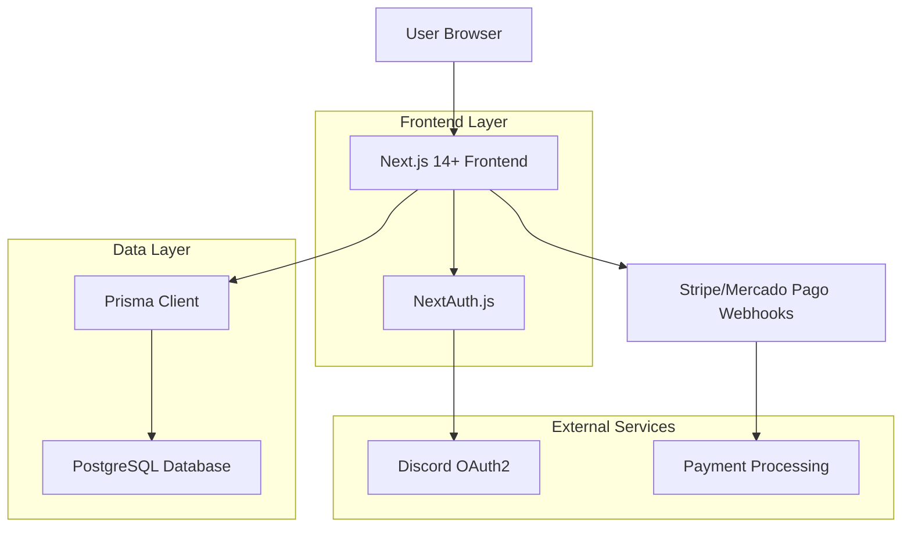
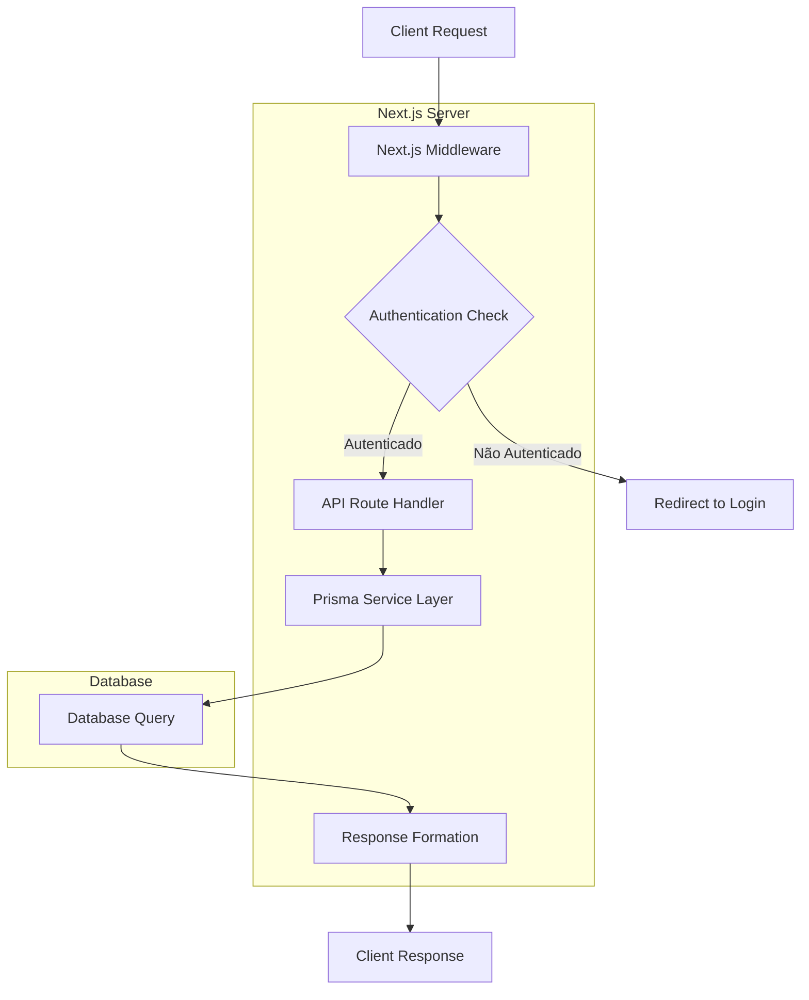
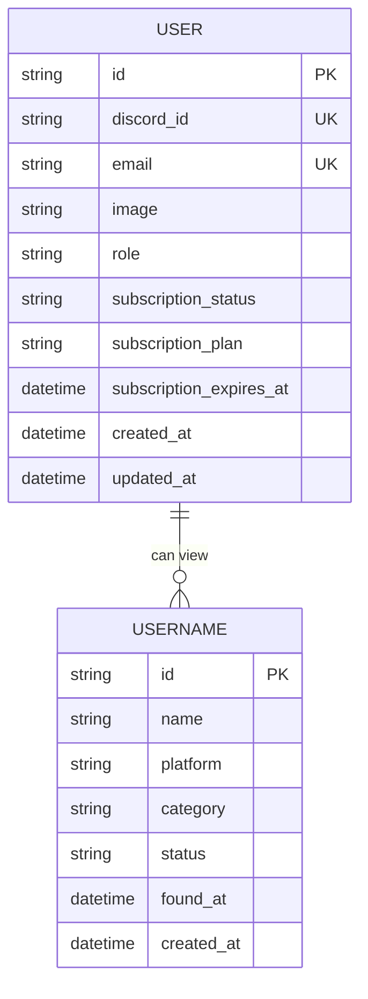

## 1. Architecture design



## 2. Technology Description

- **Frontend:** Next.js 14+ (App Router) + TypeScript + Tailwind CSS
- **UI Components:** Shadcn/UI (Button, Card, Table, Badge, Dialog)
- **Initialization Tool:** create-next-app
- **Backend:** Next.js API Routes + Server Actions
- **Database:** PostgreSQL + Prisma ORM
- **Authentication:** NextAuth.js com Discord Provider
- **Payments:** Stripe/Mercado Pago (estrutura preparada)

## 3. Route definitions

| Route | Purpose |
|-------|---------|
| `/` | Landing page pública com hero, features, preços |
| `/auth/signin` | Página de login com Discord OAuth2 |
| `/dashboard` | Dashboard principal (protegido - assinantes apenas) |
| `/dashboard/category/[slug]` | Listagem de usernames por categoria |
| `/subscription` | Página de escolha de planos |
| `/api/auth/*` | NextAuth.js endpoints |
| `/api/webhooks/stripe` | Webhook para confirmação de pagamentos Stripe |
| `/api/webhooks/mercadopago` | Webhook para confirmação de pagamentos Mercado Pago |

## 4. API definitions

### 4.1 Authentication APIs

**Discord OAuth2 Login**
```
GET /api/auth/signin/discord
```

**Session Callback**
```
GET /api/auth/callback/discord
```

### 4.2 Username APIs

**Get Usernames by Category**
```
GET /api/usernames?category={category}&platform={platform}
```

Request Query Parameters:
| Param Name | Param Type | isRequired | Description |
|------------|-------------|-------------|-------------|
| category | string | true | Categoria do username (CHARS_2, CHARS_3, etc) |
| platform | string | false | Plataforma específica para filtrar |

Response:
```json
{
  "usernames": [
    {
      "id": "uuid",
      "name": "username_raro",
      "platform": "DISCORD",
      "category": "CHARS_2",
      "status": "AVAILABLE",
      "found_at": "2024-01-15T10:30:00Z"
    }
  ]
}
```

### 4.3 Subscription APIs

**Check Subscription Status**
```
GET /api/subscription/status
```

Response:
```json
{
  "status": "ACTIVE",
  "plan": "MONTHLY",
  "expires_at": "2024-02-15T10:30:00Z"
}
```

## 5. Server architecture diagram



## 6. Data model

### 6.1 Data model definition



### 6.2 Data Definition Language

**User Table (users)**
```sql
-- create table
CREATE TABLE users (
    id UUID PRIMARY KEY DEFAULT gen_random_uuid(),
    discord_id VARCHAR(255) UNIQUE NOT NULL,
    email VARCHAR(255) UNIQUE NOT NULL,
    image TEXT,
    role VARCHAR(20) DEFAULT 'USER' CHECK (role IN ('USER', 'ADMIN')),
    subscription_status VARCHAR(20) DEFAULT 'INACTIVE' CHECK (subscription_status IN ('ACTIVE', 'INACTIVE')),
    subscription_plan VARCHAR(20) CHECK (subscription_plan IN ('DAILY', 'WEEKLY', 'MONTHLY')),
    subscription_expires_at TIMESTAMP WITH TIME ZONE,
    created_at TIMESTAMP WITH TIME ZONE DEFAULT NOW(),
    updated_at TIMESTAMP WITH TIME ZONE DEFAULT NOW()
);

-- create indexes
CREATE INDEX idx_users_discord_id ON users(discord_id);
CREATE INDEX idx_users_subscription_status ON users(subscription_status);
```

**Username Table (usernames)**
```sql
-- create table
CREATE TABLE usernames (
    id UUID PRIMARY KEY DEFAULT gen_random_uuid(),
    name VARCHAR(255) NOT NULL,
    platform VARCHAR(50) NOT NULL CHECK (platform IN ('DISCORD', 'MINECRAFT', 'INSTAGRAM', 'GITHUB', 'ROBLOX', 'TIKTOK', 'TWITTER', 'URL')),
    category VARCHAR(50) NOT NULL CHECK (category IN ('CHARS_2', 'CHARS_3', 'CHARS_4', 'PT_BR', 'EN_US', 'RANDOM')),
    status VARCHAR(20) DEFAULT 'AVAILABLE' CHECK (status IN ('AVAILABLE', 'CHECKING', 'TAKEN')),
    found_at TIMESTAMP WITH TIME ZONE DEFAULT NOW(),
    created_at TIMESTAMP WITH TIME ZONE DEFAULT NOW(),
    UNIQUE(name, platform)
);

-- create indexes
CREATE INDEX idx_usernames_category ON usernames(category);
CREATE INDEX idx_usernames_platform ON usernames(platform);
CREATE INDEX idx_usernames_status ON usernames(status);
CREATE INDEX idx_usernames_found_at ON usernames(found_at DESC);
```

### 6.3 Prisma Schema

```prisma
// This is your Prisma schema file
generator client {
  provider = "prisma-client-js"
}

datasource db {
  provider = "postgresql"
  url      = env("DATABASE_URL")
}

enum Role {
  USER
  ADMIN
}

enum SubscriptionStatus {
  ACTIVE
  INACTIVE
}

enum SubscriptionPlan {
  DAILY
  WEEKLY
  MONTHLY
}

enum Platform {
  DISCORD
  MINECRAFT
  INSTAGRAM
  GITHUB
  ROBLOX
  TIKTOK
  TWITTER
  URL
}

enum Category {
  CHARS_2
  CHARS_3
  CHARS_4
  PT_BR
  EN_US
  RANDOM
}

enum UsernameStatus {
  AVAILABLE
  CHECKING
  TAKEN
}

model User {
  id                      String             @id @default(uuid())
  discordId              String             @unique @map("discord_id")
  email                  String             @unique
  image                  String?
  role                   Role               @default(USER)
  subscriptionStatus     SubscriptionStatus @default(INACTIVE)
  subscriptionPlan       SubscriptionPlan?
  subscriptionExpiresAt  DateTime?          @map("subscription_expires_at")
  createdAt              DateTime           @default(now()) @map("created_at")
  updatedAt              DateTime           @updatedAt @map("updated_at")

  @@map("users")
}

model Username {
  id         String         @id @default(uuid())
  name       String
  platform   Platform
  category   Category
  status     UsernameStatus @default(AVAILABLE)
  foundAt    DateTime       @default(now()) @map("found_at")
  createdAt  DateTime       @default(now()) @map("created_at")

  @@unique([name, platform])
  @@map("usernames")
}
```